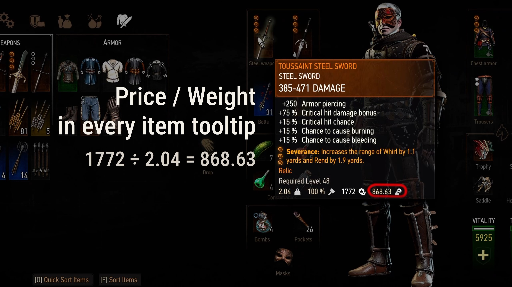
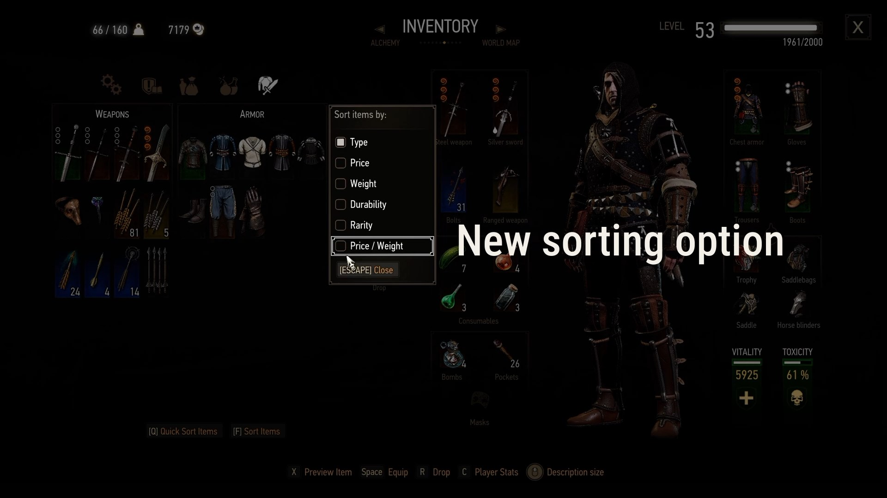

# Price / Weight - Inventory Tooltip and Sorting


Adds a `Price / Weight` value to item tooltips and a matching inventory sort option for **The Witcher 3: Wild Hunt**.

The higher the number, the more crowns the item is worth per unit of carry weight. This makes it easier to decide what to keep, sell, or drop without doing the math yourself.

## Links

- [Nexus Mods](https://www.nexusmods.com/witcher3/mods/12874)
- [Steam Workshop](https://steamcommunity.com/sharedfiles/filedetails/?id=3801197292)
- [YouTube demo](https://youtu.be/WvRqyfDV09Q)

## Features

- Displays `Price / Weight` in item tooltips.
- Adds `Price / Weight` to the inventory sorting menu.
- Sorts items with the highest value-to-weight ratio first.
- Uses the same rounded weight shown in the tooltip, keeping the displayed calculation consistent.
- Shows `N/A` for positive-price items with zero weight.
- Localized for every language currently supported by The Witcher 3.

## Calculation

```text
Price / Weight = displayed price / displayed weight
```

Example:

```text
1772 / 2.04 = 868.63
```



## Sorting

The mod adds a new sorting option to the inventory sort dialog.



## Known Limitation

In some inventory tabs, items may not appear in strict highest-to-lowest visual order.

The mod uses the game's existing inventory sorting and grid layout. Vanilla grouping and item placement can affect the final visual arrangement, especially in tabs that mix different item sizes, such as weapons. Swords, bolts, and other weapon items are fitted into the available grid cells after sorting, so smaller items may appear before or between larger ones.

The displayed `Price / Weight` values remain correct. Similar visual inconsistencies can also happen with built-in sorting modes, including `Price`.

## Compatibility

This mod changes inventory tooltip and sorting interface files.

Script Merger may help resolve script conflicts, but it cannot automatically merge compiled Flash interface files. If another mod changes the same inventory UI files, a compatibility patch or manual conflict resolution may be required.

See [MERGING.md](MERGING.md) for more detailed compatibility notes.

## Installation

1. Download the mod from [Nexus Mods](https://www.nexusmods.com/witcher3/mods/12874) or [Steam Workshop](https://steamcommunity.com/sharedfiles/filedetails/?id=3801197292).
2. For a manual install, copy the included mod folder into your `The Witcher 3\Mods` directory.
3. Run Script Merger if required.
4. Launch the game and check an inventory tooltip and the inventory sort dialog.

## Uninstallation

Remove the mod folder from your `Mods` directory.

If you created merged scripts containing files from this mod, remove or regenerate the merge after uninstalling.

## Project Notes

This repository contains edited REDkit source and generated UI assets for the mod. The game uses the cooked and compiled assets, not the raw `.fla` or `.as` files directly.

See [DEVELOPMENT.md](DEVELOPMENT.md) for maintenance notes, Flash font precautions, and the release checklist.
